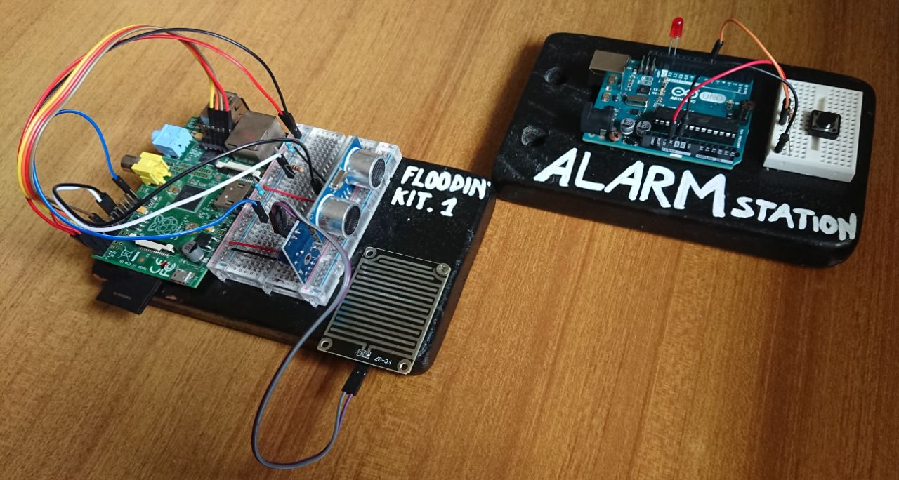

# City Flooding Kit

This project lies in the context of the smart environment, regarding prevention and **warning systems** for environmental disasters concerning, in particular, river flooding.  

The goal of our work is to provide a configurable kit for hypothetical public authorities, to effectively monitor the critical conditions that precede an emergency situation.  

## Course reference

This prototype was presented as our final project for the *Smart City and Mobile Technologies* course:  
https://www.unibo.it/en/teaching/course-unit-catalogue/course-unit/2019/412645

## Report and documentation

- [A brief presentation in Italian language](presentation.pdf)  
- [A complete project report in Italian language](report.pdf)  

## Flooding Kit and Alarm Station souvenir photo

